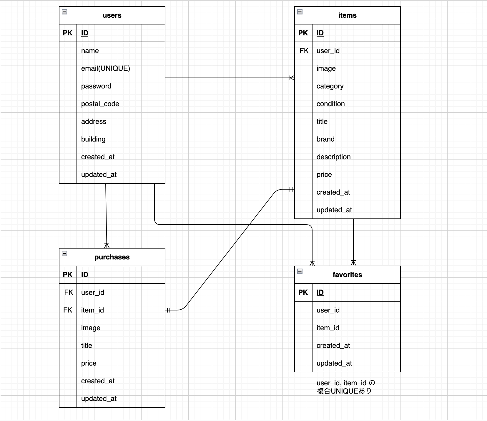

# flea-market-app

## プロジェクトの概要
このプロジェクトは、商品の売買を行うシステムです。商品一覧の確認、詳細ページ閲覧、購入、出品、ユーザープロフィール確認、編集などが可能です。

## アプリケーション名
フリーマーケット

## 環境構築

### Dockerビルド
1. ディレクトリを作成する
2. docker-compose up -d --build
3. DockerDesktopアプリを立ち上げる
4. git clone git@github.com:aya1204/flea-market-app.git

### Laravel環境構築
1. docker-compose exec php bash
2. composer -v
(composerがインストールできているか確認する)
3. Laravelプロジェクトの作成
　composer create-project "laravel/laravel=8.*" . --prefer-dist
4. 時間設定の編集
　src/config/app.phpを開き、70行目あたりの'timezone' => 'UTC',を'timezone' => 'Asia/Tokyo',に変更
5. .envに以下の環境変数を追加
　DB_CONNECTION=mysql
　DB_HOST=mysql
　DB_PORT=3306
　DB_DATABASE=laravel_db
　DB_USERNAME=laravel_user
　DB_PASSWORD=laravel_pass
6. アプリケーションキーの作成
　php artisan key:generate
7. マイグレーションの実行
　php artisan migrate
8. シーディングの実行
　php artisan db:seed

## 使用技術（実行環境）
- PHP 7.4.9 (cli)
- Laravel 8.83.29
- Laravel Fortify (メール認証機能使用)
- Mailhog (ローカル環境のメール確認ツール)
- Composer version 2.8.5
- MySQL 8.0.26

## メール認証について
本アプリではユーザー登録後、メール認証を行うことでログインが完了します。
ローカル開発環境では Mailhog を使用し、 http://localhost:8025 で確認可能です。

## ER図
- users ↔︎ items：１対多
- users ↔︎ purchases：１対多
- users ↔︎ favorites：１対多
- items ↔︎ purchases：１対１
- items ↔︎ favorites：１対多

## URL
- ローカル環境：http://localhost
- Githubリポジトリ：https://github.com/aya1204/flea-market-app
- 商品一覧画面（トップ画面）：http://localhost/
- 商品一覧画面（トップ画面）_マイリスト：http://localhost/?tab=mylist
- 会員登録画面：http://localhost/register
- ログイン画面：http://localhost/login