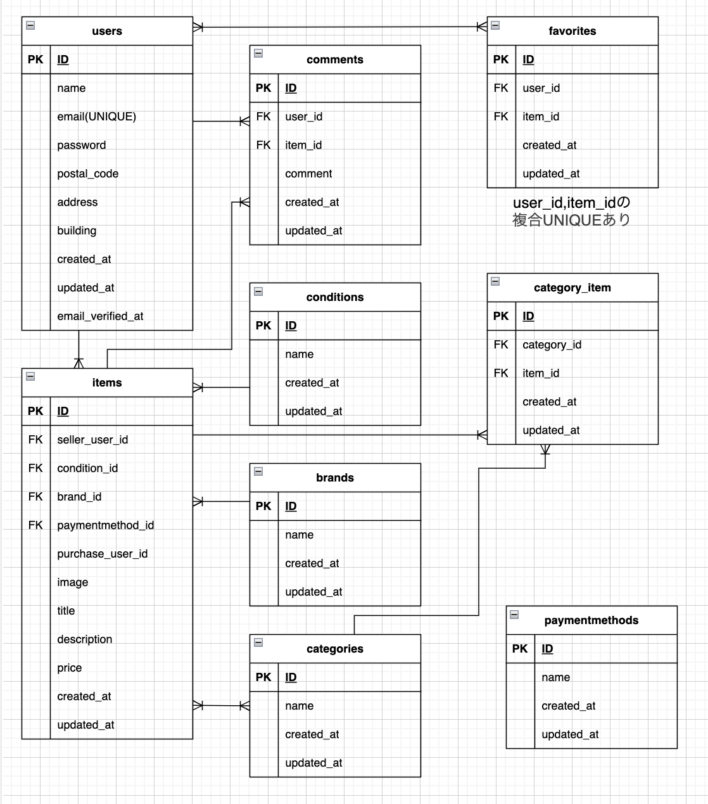

# flea-market-app

## プロジェクトの概要
このプロジェクトは、商品の売買を行うフリーマーケットアプリケーションです。
ユーザー登録（メール認証）、ログイン、商品一覧の確認、詳細ページ閲覧、購入、出品、ユーザープロフィール確認、編集などが可能です。

メール認証には開発用メールサーバー「Mailhog」を使用し、購入処理は「Stripe（テスト用API）」と連携しています。

## アプリケーション名
フリーマーケット

## 環境構築

### Dockerビルド

1. 任意のディレクトリを作成して移動
    mkdir 任意のディレクトリ名
    cd 任意のディレクトリ名

2. リポジトリをクローンしてディレクトリ名を変更
    git clone git@github.com:aya1204/flea-market-app.git test

3. `test`ディレクトリへ移動
    cd test

4. Dockerビルド・起動
    docker-compose up -d --build

### Laravel環境構築

1. PHPコンテナに移動してLaravelのパッケージのインストール
    docker-compose exec php bash
    composer install

2. '.env.example'の内容をコピーして'.env'を作成
    cp .env.example .env

3. .envファイルを編集し、以下の環境変数を設定してください。
※記載がない場合、アプリケーションが正しく動作しない可能性があります。
    DB_HOST=mysql
    DB_DATABASE=laravel_db
    DB_USERNAME=laravel_user
    DB_PASSWORD=laravel_pass
    MAIL_FROM_ADDRESS=example@example.com

4. APP_KEYを作成
    php artisan key:generate

※ `.env` の内容を編集してから、必ず `php artisan key:generate` を実行してください。

5. マイグレーションとシーディングを実行する
    php artisan migrate --seed
    exit

## 画像保存
### 1. 画像ディレクトリを作成し、商品画像を保存
    mkdir ./src/storage/app/public/images

    curl -o src/storage/app/public/images/Armani+Mens+Clock.jpg "https://coachtech-matter.s3.ap-northeast-1.amazonaws.com/image/Armani+Mens+Clock.jpg"

    curl -o src/storage/app/public/images/HDD+Hard+Disk.jpg "https://coachtech-matter.s3.ap-northeast-1.amazonaws.com/image/HDD+Hard+Disk.jpg"

    curl -o src/storage/app/public/images/iLoveIMG+d.jpg "https://coachtech-matter.s3.ap-northeast-1.amazonaws.com/image/iLoveIMG+d.jpg"

    curl -o src/storage/app/public/images/Leather+Shoes+Product+Photo.jpg "https://coachtech-matter.s3.ap-northeast-1.amazonaws.com/image/Leather+Shoes+Product+Photo.jpg"

    curl -o src/storage/app/public/images/Living+Room+Laptop.jpg "https://coachtech-matter.s3.ap-northeast-1.amazonaws.com/image/Living+Room+Laptop.jpg"

    curl -o src/storage/app/public/images/Music+Mic+4632231.jpg "https://coachtech-matter.s3.ap-northeast-1.amazonaws.com/image/Music+Mic+4632231.jpg"

    curl -o src/storage/app/public/images/Purse+fashion+pocket.jpg "https://coachtech-matter.s3.ap-northeast-1.amazonaws.com/image/Purse+fashion+pocket.jpg"

    curl -o src/storage/app/public/images/Tumbler+souvenir.jpg "https://coachtech-matter.s3.ap-northeast-1.amazonaws.com/image/Tumbler+souvenir.jpg"

    curl -o src/storage/app/public/images/Waitress+with+Coffee+Grinder.jpg "https://coachtech-matter.s3.ap-northeast-1.amazonaws.com/image/Waitress+with+Coffee+Grinder.jpg"

    curl -o src/storage/app/public/images/外出メイクアップセット.jpg "https://coachtech-matter.s3.ap-northeast-1.amazonaws.com/image/%E5%A4%96%E5%87%BA%E3%83%A1%E3%82%A4%E3%82%AF%E3%82%A2%E3%83%83%E3%83%95%E3%82%9A%E3%82%BB%E3%83%83%E3%83%88.jpg"

### 2. ユーザーアイコン、favoriteアイコン、commentアイコン、COACHTECHロゴを保存

画像は下記URLよりダウンロードの上、`src/storage/app/public/images`フォルダに保存してください。
※ ファイル名は必ず指定された名前で保存してください。

- [user1_icon.png](https://www.dropbox.com/scl/fi/h33nr2bl9qmeb5d97c93b/user1_icon.png?rlkey=dlqan9c4c8v6cxible504hrcl&st=1228s52v&dl=0)

- [user2_icon.png](https://www.dropbox.com/scl/fi/jkiscepmcxodstxitoici/user2_icon.png?rlkey=3dm5zqv5ho6qqxmmtr0yfn5cf&st=q4gn2q2g&dl=0)

- [user3_icon.png](https://www.dropbox.com/scl/fi/7obivehya19de01uctsb9/user3_icon.png?rlkey=vrmha6ofqt51fhl6m0ub33ecf&st=ur9ru88r&dl=0)

- [favorite_icon.png](https://www.dropbox.com/scl/fi/5w4uykyiu607ancm2u5u9/favorite_icon.png?rlkey=5dci5ufi4g6w47nx1qjv6lv7g&st=186k0hw8&dl=0)

- [comment_icon.png](https://www.dropbox.com/scl/fi/0woeu6q6wdc93c5o2xecs/comment_icon.png?rlkey=m6ea6gsboc4yllvlllsqua4en&st=jong8q3m&dl=0)

- [logo.svg](https://www.dropbox.com/scl/fi/3lldzhq91bo2ytzkel6nf/logo.svg?rlkey=b5185j7e9pmpmdb965f49h3ye&st=4sgoqg8q&dl=0)

### 3. 新規登録ユーザーや出品する商品の画像保存

アプリの動作確認用に、以下のファイルを使用できます。
画像は下記URLよりダウンロードの上、`src/storage/app/public/images`フォルダに保存してください。
※ ファイル名は必ず指定された名前で保存してください。

- [test_user_icon.png](https://www.dropbox.com/scl/fi/9x6fhss6dyel12j8nui8h/test_user_icon.png?rlkey=mwwrn8k3d8f8uhc5bn13ei8i6&st=ufnsavy6&dl=0)

- [kiwi.png](https://www.dropbox.com/scl/fi/yv6ad46qho8o9x9t2jb4w/kiwi.png?rlkey=62v6zy2adubnnawk2xgxi4iln&st=vg99k2xf&dl=0)

- [hoodie.png](https://www.dropbox.com/scl/fi/fv9k8sv7b3subizjg21ly/hoodie.png?rlkey=d9wicvs0nvyfmvooojmr17i6u&st=43v3e63y&dl=0)

- [みかん.png](https://www.dropbox.com/scl/fi/em7ppanps29pwh9km3cci/みかん.png?rlkey=2rsx9q97srsyxcsbafxdi3ed6&st=kb85fwum&dl=0)

- [sneakers_red.png](https://www.dropbox.com/scl/fi/23trl2x4lwlbh5hrxhvoo/sneakers_red.png?rlkey=zm6o1mcbyeru7dci0v8rkcx5w&st=c3pupn3d&dl=0)

-[sandwich.png](https://www.dropbox.com/scl/fi/kdg0vbwtthecbtwazc0kz/sandwich.png?rlkey=onmz6ig0yzdnacb2se4rfyc5h&st=jnpgxfxj&dl=0)

ご自由にアプリの動作確認用としてご利用ください。

### 4. PHPコンテナ内に移動して、ストレージに公開アクセスするためのシンボリックリンクを作成
    docker-compose exec php bash
    php artisan storage:link

## Stripe連携の準備
本アプリケーションでは、Stripeのテスト用APIを利用して購入処理を行っています。
セキュリティの観点から、Stripeの公開キーおよびシークレットキーは公開リポジトリに含まれていません。
下記の手順でご自身のStripeアカウントからAPIキーを取得し、`.env`ファイルに設定してください。

### 1. Stripeのアカウントを作成
以下のリンクより無料アカウントを作成してください。
- https://dashboard.stripe.com/register

### 2. テストAPIキーの取得
- Stripeダッシュボードにログインする
- 右上にある３本線「メニュー」→ 一番下の「開発者」→ 下から３番目の「APIキー」に移動
- 以下のようなキーをコピーして`.env`ファイルに設定してください。
    STRIPE_KEY=pk_test_************************
    STRIPE_SECRET=sk_test_***************

※ 上記は一例です。実際にはご自身のテスト用キーを使用してください。
※ Stripe連携には「公開キー」と「シークレットキー」の両方が必要です。

### 3. 変更を反映する
    php artisan config:clear
    exit

## 単体テスト環境構築
### 1. MySQLにログインする
    docker-compose exec mysql bash
    mysql -u root -p
    root

### 2. MySqlコンテナ内でflea_market_testデータベースを作成
    CREATE DATABASE flea_market_test;
    SHOW DATABASES;
    (flea_market_testが表示されたらOK)
    exit
    exit

### 3. PHPコンテナ内で.env.testingファイルを作成
    docker-compose exec php bash
    cp .env .env.testing

### 4. 作成できたら編集する
    APP_ENV=testing
    APP_KEY=
    DB_CONNECTION=mysql_test
    DB_DATABASE=flea_market_test
    DB_USERNAME=root
    DB_PASSWORD=root

### 5. APP_KEYに新たなテスト用のアプリケーションキーを加える
    php artisan key:generate --env=testing

### 6. キャッシュの削除をする
    php artisan config:clear

## 単体テストの手順
※ UserFactory、ItemFactory、CategoryFactory、ConditionFactory、BrandFactory などは、テストコード内でダミーデータ生成のために使用しています。アプリケーション本体では主にSeeder（例：ConditionsTableSeeder）を使用しています。

※そのままPHPコンテナ内でコマンド入力を行ってください。
例）OK (1 test, 7 assertions) こんな感じで表示されたらテスト成功です。

### 1. AuthTestの単体テスト確認
    vendor/bin/phpunit tests/Feature/AuthTest.php

### 2. ItemTestの単体テスト確認
    vendor/bin/phpunit tests/Feature/ItemTest.php

### 3. ProfileTestの単体テスト確認
    vendor/bin/phpunit tests/Feature/PurchaseTest.php

### 4. SellTestの単体テスト確認
SellTest実行前に、以下のコマンドでGD拡張をインストールしてください。
①必要なパッケージをインストール
    apt update
    apt install -y libpng-dev libjpeg-dev libfreetype6-dev
②GDの設定とインストール
    docker-php-ext-configure gd --with-freetype --with-jpeg
    docker-php-ext-install gd
    exit
③PHPモジュールにgdが含まれているか確認
    php -m | grep gd
(gdと表示されたらOK)
④PHPコンテナに入ってSellTest実行
    docker-compose exec php bash
    vendor/bin/phpunit tests/Feature/SellTest.php

## 使用技術（実行環境）
- PHP 7.4.9 (Dockerコンテナ内)
- Laravel 8.83.29
- Laravel Fortify (メール認証機能使用)
- Mailhog (ローカル環境のメール確認ツール)
- Composer version 2.8.9
- MySQL 8.0.26

## メール認証について
本アプリではユーザー登録後、メール認証を行うことでログインが完了します。
ローカル開発環境では Mailhog を使用し、 http://localhost:8025 で確認可能です。

## ER図
- users ↔︎ items：１対多
- users ↔︎ comments：１対多
- users ↔︎ favorites：多対多
- items ↔︎ comments：１対多
- items ↔︎ conditions：多対１
- items ↔︎ brands：多対１
- items ↔︎ categories：多対多
- items ↔︎ category_item：１対多
- categories ↔︎ category_item：１対多

※ ER図が表示されない場合は `docs/er_diagram.png` を直接開いてください。

## URL
- ローカル環境：http://localhost
- Githubリポジトリ：https://github.com/aya1204/flea-market-app
- 商品一覧画面（トップ画面）：http://localhost/
- 商品一覧画面（トップ画面）_マイリスト：http://localhost/?tab=mylist
- 会員登録画面：http://localhost/register
- メール認証画面：http://localhost/email/verify
- ログイン画面：http://localhost/login
- 商品出品画面：http://localhost/sell
- プロフィール画面：http://localhost/mypage
- プロフィール編集画面：http://localhost/mypage/profile
- プロフィール画面_購入した商品一覧：http://localhost/mypage?tab=buy
- プロフィール画面_出品した商品一覧：http://localhost/mypage?tab=sell

## シーディングされたユーザー情報
ユーザーアイコンはsrc/storage/app/public/imagesの中にあります。

- **ユーザー1**
    - メールアドレス：`test@example.com`
    - パスワード：`password`
    - ユーザーアイコン：`user1_icon.png`
    - 郵便番号：123-4567
    - 住所：東京都渋谷区千駄ヶ谷1-2-3
    - 建物名：千駄ヶ谷マンション101

- **ユーザー2**
    - メールアドレス：`test2@example.com`
    - パスワード：`password`
    - ユーザーアイコン：`user2_icon.png`
    - 郵便番号：123-4567
    - 住所：東京都渋谷区千駄ヶ谷1-2-3
    - 建物名：千駄ヶ谷マンション102

- **ユーザー3**
    - メールアドレス：`test3@example.com`
    - パスワード：`password`
    - ユーザーアイコン：`user3_icon.png`
    - 郵便番号：123-4567
    - 住所：東京都渋谷区千駄ヶ谷1-2-3
    - 建物名：千駄ヶ谷マンション103

※テストユーザーはすでにメール認証済みにしています。

## 新規登録ユーザーの例
ユーザーアイコンはsrc/storage/app/public/imagesの中にあります。

- **新規登録ユーザー**
    - メールアドレス：`kiwi@example.com`
    - パスワード：`password`
    - ユーザーアイコン：`kiwi.png`
    - 郵便番号：000-0000
    - 住所：北海道北見市田端町123
    - 建物名：（建物名はnullです）
